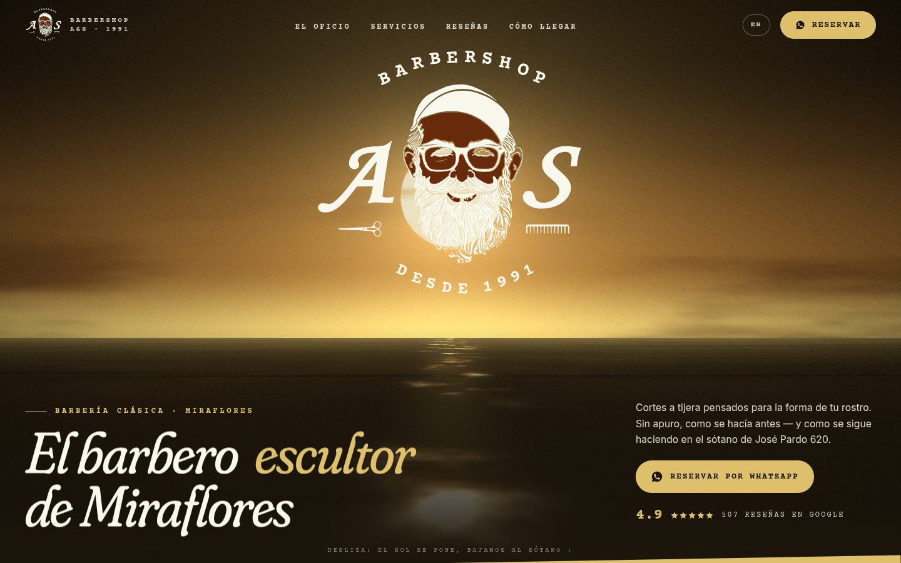
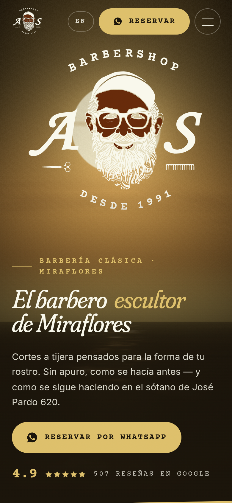

# Barbershop A&S — demo de rediseño web (concepto)

> ⚠️ **Demo conceptual NO oficial.** Creada por INKRAAD para proponer un sitio web a Barbershop A&S. No está afiliada ni aprobada por el negocio.
> Los datos reales provienen de fuentes públicas (ficha de Google, Facebook, Instagram) investigadas el 06-oct-2026; todo lo demás está marcado como **ejemplo**.



## La marca
- **Rubro:** barbería clásica para caballeros ("¡CLÁSICA!", como se presenta en Facebook). Barbero principal: **Alonso**.
- **Ubicación:** Av. José Pardo 620, sótano, tienda #18 — **Miraflores, Lima**.
- **Reputación:** **4.9★ con 507 reseñas en Google** (cifra del espejo de Google Maps, snapshot ~mar-2026; confirmar en vivo), 18.276 seguidores en Facebook.
- **Presencia digital actual:** **sin sitio web**. La ficha de Google enlaza a WhatsApp; además tiene Facebook (/ASBarbershop) e Instagram (@ays_barbershop_since_1987).
- Clientela local e internacional (muchas reseñas en inglés) → la demo es **bilingüe ES/EN**.

## Concepto creativo: *"Al atardecer, bajo José Pardo"*
El logo oficial de A&S es el maestro barbero de barba blanca recortado sobre **un atardecer en el mar** — el Pacífico de Miraflores. La demo convierte ese fondo en
una escena WebGL viva: el sol dorado brilla detrás del logo y su reflejo titila sobre el agua. Al hacer scroll **el sol se pone y la escena se oscurece: "bajamos al sótano"**,
hasta la tienda 18, donde un dial de ascensor vintage marca el descenso (AV → 1 → S → 18). Todo en la paleta sepia del logo, con tipografía de máquina de escribir y serif caligráfica.

## Qué se construyó
**Secciones**
1. **Loader de marca** — el logo "amanece" desde la línea del horizonte con un contador en Courier; el telón se abre en dos (cielo / mar).
2. **Hero** — atardecer WebGL (shader propio) + logo vectorial + titular "El barbero escultor de Miraflores" + rating 4.9★ + CTA a WhatsApp.
3. **Marquesina** con los sellos de la casa (¡Clásica!, corte a tijera, desde 1991…).
4. **El oficio / Conoce a Alonso** — manifiesto que se "ilumina" palabra por palabra con el scroll, foto en arco que se abre, contadores (1991 · 4.9★ · 18.276).
5. **El ritual A&S** — scroll horizontal fijado con 4 tiempos (diagnóstico, tijera sin apuro, detalle, productos) basados en lo que cuentan las reseñas.
6. **Servicios** — carta con poste de barbero **3D** (Three.js/R3F) en los colores de la marca que gira y acelera con la velocidad del scroll.
7. **Reseñas de Google** — 4 reseñas reales (original en inglés + traducción libre), contador animado, carrusel arrastrable.
8. **Galería** — mosaico con parallax y revelado por máscara; fotos viradas a sepia.
9. **Cómo llegar** — storytelling "Baja al sótano" con dial de ascensor, escalera que se dibuja con el scroll, mapa embebido, horario con "Abierto/Cerrado ahora" (hora de Lima).
10. **Reserva** — arma el mensaje de WhatsApp eligiendo servicio y día (sin backend) + halo de "sol" que sigue al cursor.
11. **Footer** con dirección, contacto, redes y aviso de demo.

**Efectos y microinteracciones**
- Shader GLSL de atardecer (cielo, nubes fbm, disco solar, mar en perspectiva con destellos) controlado por scroll y mouse.
- Poste de barbero 3D con shader de franjas, latón y vidrio; `frameloop` se pausa fuera de pantalla.
- GSAP ScrollTrigger: pin + scroll horizontal, parallax, clip-path reveals, textos por palabras, dibujo de trazo SVG, contadores.
- Lenis (smooth scroll) sincronizado con ScrollTrigger.
- Motion: botones magnéticos, menú móvil con máscara, carrusel con drag.
- Cursor personalizado con etiqueta contextual (solo puntero fino), grano de película, logo que se desenfoca/escala al entrar.
- **Bilingüe ES/EN** (botón en la barra o `?lang=en`).

**Responsive, rendimiento y accesibilidad**
- Móvil: el 3D del poste se sustituye por un poste CSS; el shader del hero corre a DPR reducido; el ritual pasa a vertical.
- Los componentes Three.js se cargan de forma diferida (`lazy`) y se pausan fuera de pantalla.
- `prefers-reduced-motion`: sin smooth scroll, sin animaciones de entrada, shader estático, poste CSS.
- Contraste AA (hueso/dorado sobre espresso ≥ 10:1), textos alternativos, navegación por teclado, foco visible, enlace "saltar al contenido", `aria-label` en titulares animados.
- SEO: `title`/`description`, Open Graph + Twitter card (`public/og-image.jpg`), favicon, `lang` dinámico y schema.org **HairSalon** (LocalBusiness) con dirección, geo, horario y redes.

## Identidad
- **Logo oficial recreado en SVG** (`public/brand/ays-logo*.svg`, copia en `../brand/`): la ilustración, las letras A y S, la tijera y el peine se vectorizaron
  del original (separación de capas + potrace, `scripts/logo-work/masks.py`) y los textos en arco "BARBERSHOP" / "DESDE 1991" se recompusieron con Courier Prime Bold
  letra por letra en las posiciones medidas (`scripts/trace-logo.mjs`). El original (`../brand/logo-facebook-943x960.jpg`) se conserva al lado.
- **Manual de marca** creado: `../brand/manual-de-marca.md` (paleta exacta, tipografías, tono, iconografía, usos).
- Paleta: `#1B150B` espresso · `#3A2812` tabaco · `#662A0B` óxido · `#A16C30` cobre · `#DDBF6A` dorado · `#F9F8EC` hueso.
- Tipografías (OFL): Fraunces (titulares, itálica caligráfica), Courier Prime (sellos/datos, como el arco del logo), Inter (texto).

## Datos de ejemplo / por confirmar (no presentados como reales)
| Dato | Estado en la demo |
|---|---|
| **Precios** (S/ 60, S/ 35, S/ 45) y **duraciones** | **EJEMPLO** — A&S no publica tarifas. Marcados con etiqueta "Ejemplo" y nota al pie. |
| Servicios **arreglo de barba** y **afeitado a navaja** | **Por confirmar** (no aparecen en las fuentes). Marcados con etiqueta. |
| **Fotos** (galería, ritual, oficio) | **Referenciales** de Unsplash; reemplazar por fotos reales del Instagram. La foto de "El oficio" es de archivo (NYPL), no es Alonso. |
| **Año de fundación** | Se usa **1991** porque así lo dice el logo; Instagram dice "since 1987" y Facebook "46 años". Aviso visible en la página. |
| Pasos 2–4 de "Cómo llegar" | Redacción basada en la dirección (sótano, tienda 18); confirmar el recorrido real. |
| Dominio `barbershop-ays.example` en canonical/schema | Marcador de posición. |
| Reseñas | **Reales** (Google), sin autor porque la fuente no lo muestra; traducciones al español libres. |

Datos reales usados: dirección, coordenadas, teléfono/WhatsApp, email, horario, rating y nº de reseñas, seguidores de Facebook, redes, nombre "Alonso", servicios de corte con asesoría según rostro/cráneo y recomendación de productos.

## Tecnologías
Vite 8 · React 19 · TypeScript · Tailwind CSS v4 · Three.js + @react-three/fiber + @react-three/drei · GSAP + ScrollTrigger · Lenis · Motion · Fontsource · sharp/potrace/opentype.js (pipeline del logo) · Playwright-core (capturas).

## Cómo correrlo
```bash
npm install
npm run dev        # desarrollo
npm run build      # build estático en dist/
npm run preview    # sirve dist/ en http://localhost:4318
npm run logo       # regenera los SVG del logo (requiere python3 + scipy + potrace para masks.py)
URL=http://localhost:4318/ npm run shots   # capturas (usa /usr/bin/google-chrome)
```

## Capturas
| Escritorio (1440) | Móvil (390) |
|---|---|
|  |  |

- Página completa: `screenshots/desktop-1440-full.jpg`, `screenshots/mobile-390-full.jpg`
- Secciones: `screenshots/desktop-1440-{oficio,ritual,servicios,resenas,llegar,reserva}.png`
- Loader: `screenshots/preloader-desktop-1440.png` · Menú móvil: `screenshots/mobile-390-menu.png`
- Consola del navegador durante las capturas: `screenshots/console-errors.txt`

## Créditos de imágenes (Unsplash License — uso libre)
- *Barber cutting a man's hair in a vintage shop* — The New York Public Library — https://unsplash.com/photos/BQUJyA2C97g (`oficio-maestro`)
- *Barber cutting hair in a vintage barbershop* — The New York Public Library — https://unsplash.com/photos/0eqUBcAeOtc (`salon-archivo`)
- *Barber cutting hair with scissors and comb* — Josh Marty — https://unsplash.com/photos/sdh4g0H-uXg (`ritual-tijera`)
- *Barber tools in a holder with clippers* — Josh Marty — https://unsplash.com/photos/ciMmm8_xKYo (`estacion`)
- *Barber shaves man's beard with straight razor* — Antonio Reynoso — https://unsplash.com/photos/1Ig9rw7aC5g (`ritual-navaja`)
- *Stainless steel scissors and hair comb* — Sinval Carvalho — https://unsplash.com/photos/WbEibGKHBMY (`herramientas`)
- *A black and white photo of a barber cutting a customer's hair* — Quan Jing — https://unsplash.com/photos/F9MfiGwHI9k (`corte-film`)

Logo: propiedad de Barbershop A&S (recreación vectorial solo para esta propuesta). Fuentes: Fraunces, Courier Prime e Inter (SIL Open Font License).
